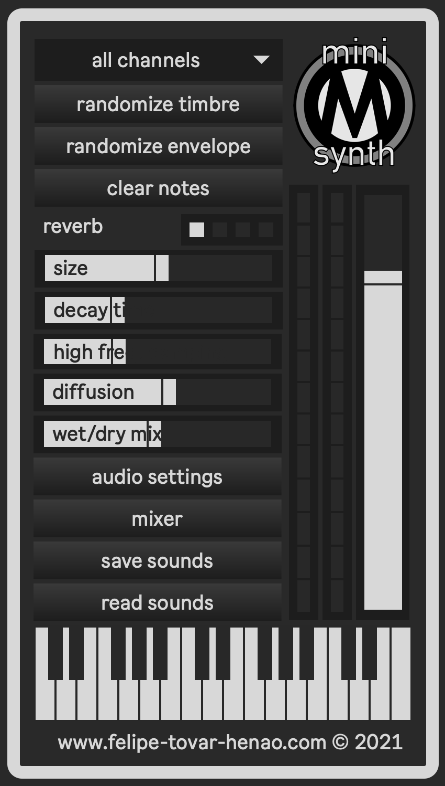
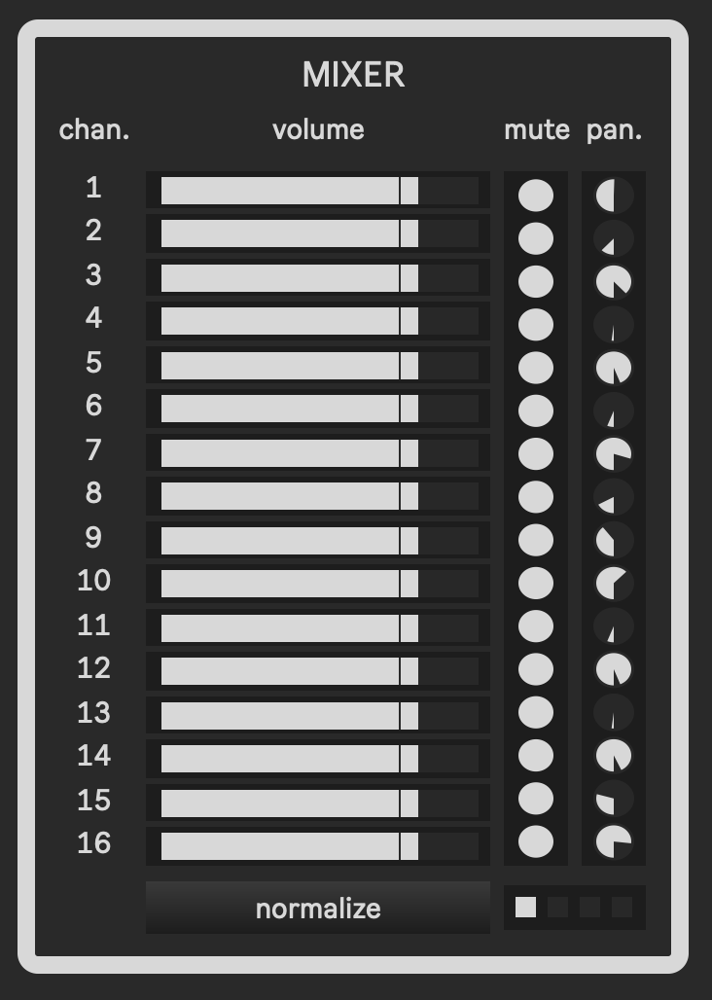
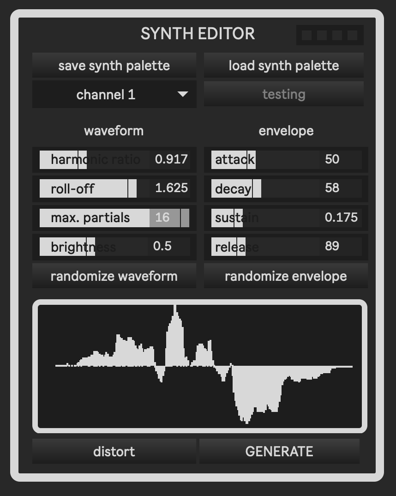
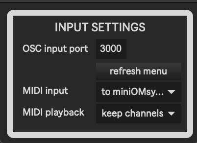

# **miniOMsynth**

### Description
  **miniOMsynth** is a user-friendly synthesizer app made in **MaxMSP**, to facilitate OSC playback from **OpenMusic** in **macOS**.

  Given that some of the existing external applications for OM playback may present compatibility issues — e.g. outdated dependencies — this is meant to be an easy-to-use alternative for OM users. 

  **miniOMsynth** has microtonal playback support for up to 16 MIDI channels, via OSC or MIDI. When the application is launched, each channel is assigned a randomly generated waveform and envelope to provide instant timbral contrast between channels. The generated waveforms and envelopes can also be edited, saved, and loaded, via the synth editor, as a way to provide timbral consistency from session to session. 
  The saved files will consist of 16 sound files in `.aiff` format and a `.JSON` file. To load a saved synth palette, simply select the corresponding `.JSON` file and **miniOMsynth** will take care of the rest.
  
  **miniOMsynth** also contains a mixer window to individually control panning and volume for each channel. 
	

### OpenMusic set up
#### OSC playback (recommended)
- In `OpenMusic Preferences/MIDI`, enable OSC communication between OM and **miniOMsynth**, by setting the default score player to `osc-scoreplayer`. Check the `Force Score Player` box.

#### MIDI playback
- If OSC playback does not work, **miniOMsynth** also has MIDI playback support. In `OpenMusic Preferences/MIDI`, set the default score player to `midi-player`. Then, in `Ports setup`, include `to miniOMsynth` as an output device.

|  |  |
|------------|------------|
|  |  |

