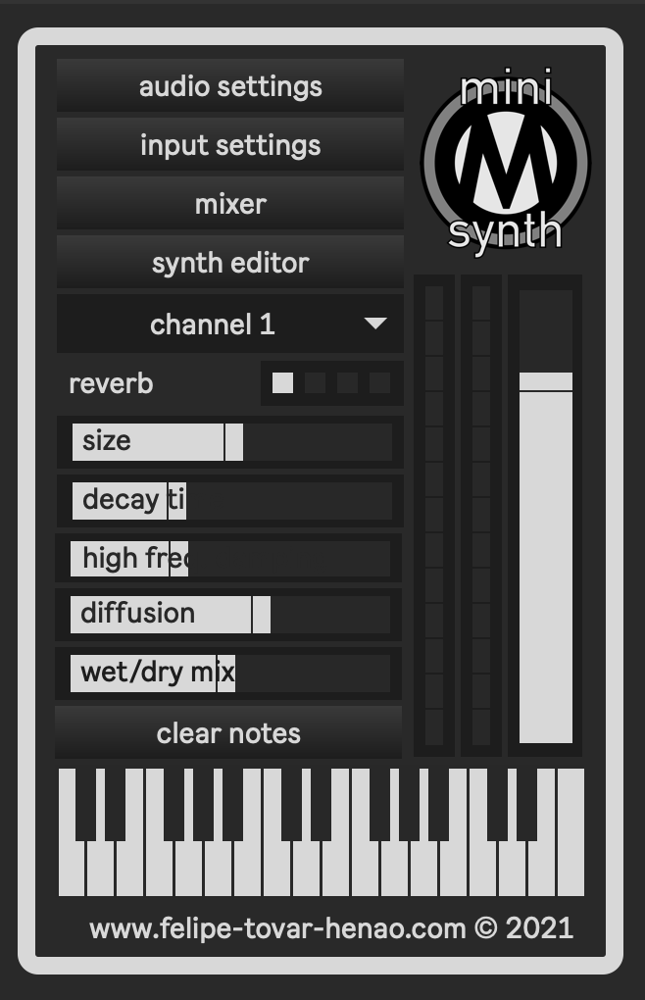

# **miniOMsynth**

**miniOMsynth** is a user-friendly synthesizer app made in **MaxMSP**, to facilitate OSC playback from **OpenMusic** in **macOS**.

Given that some of the existing external applications for OM playback may present compatibility issues — e.g. outdated dependencies — this is meant to be an easy-to-use alternative for OM users. 

**miniOMsynth** has microtonal playback support for up to 16 MIDI channels. Each channel is assigned a randomly generated waveform and envelope to provide instant timbral contrast between channels. It also contains a mixer window to individually control panning and volume for each channel.

The generated waveforms and envelopes can also be saved and loaded as a way to provide timbral consistency from session to session. The saved files will consist of 16 sound files in `.aiff` format and a `.JSON` file. 
	
To load a saved sound palette, simply select the corresponding `.JSON` file and **miniOMsynth** will take care of the rest.
  
To enable OSC communication between OM and **miniOMsynth**, make sure the default score player is set to osc-scoreplayer.

|  |  |

